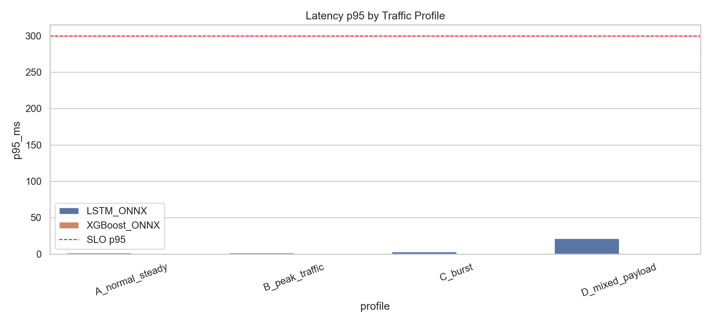
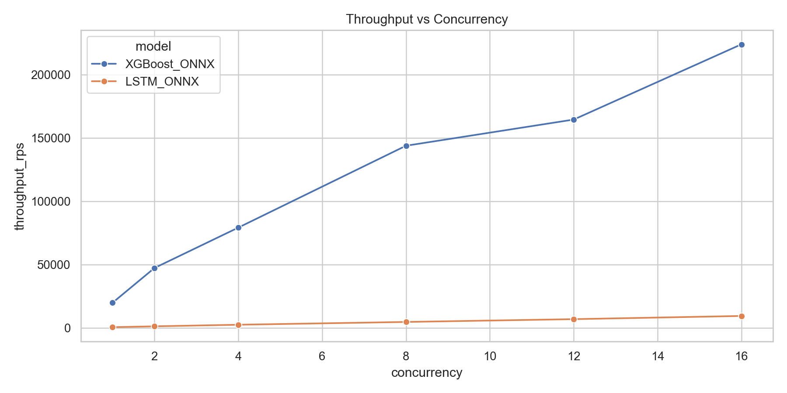
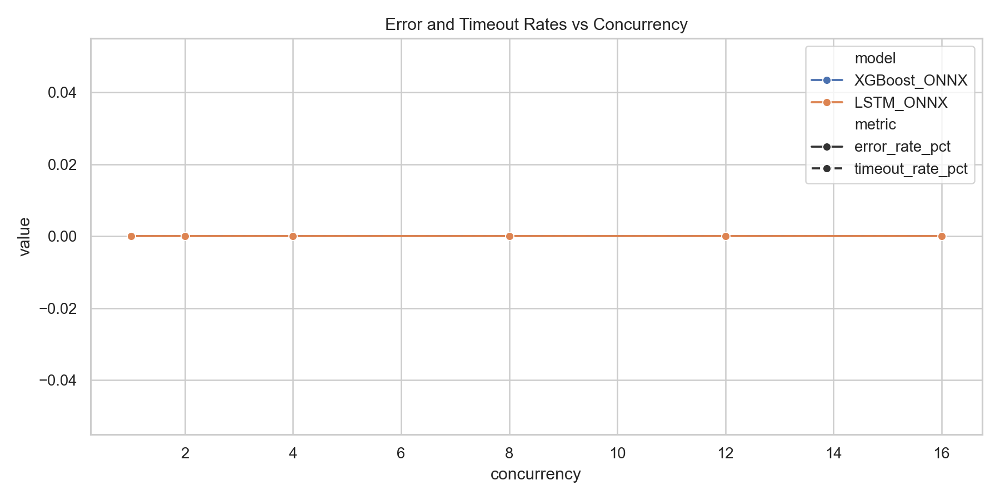
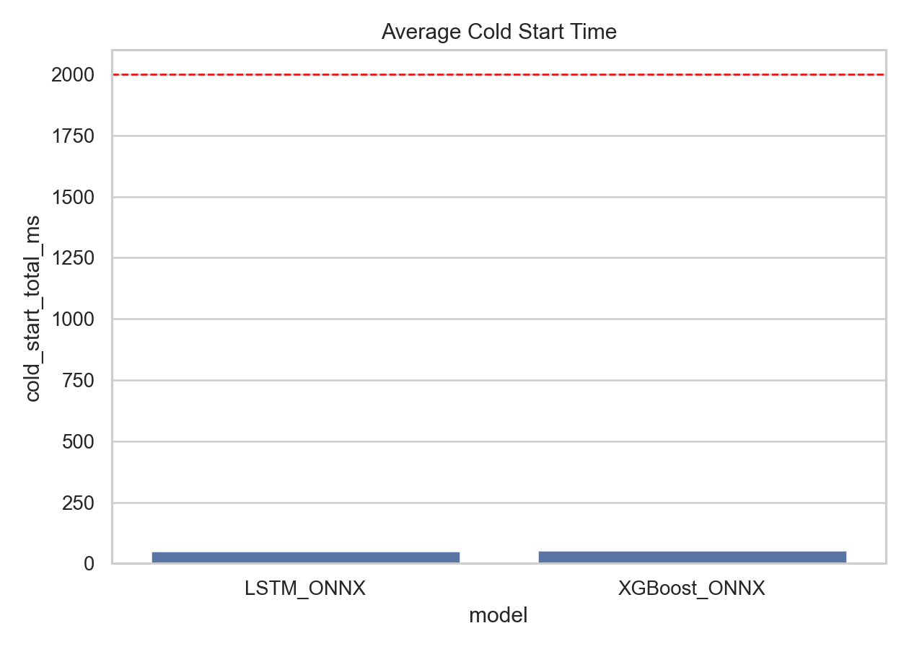
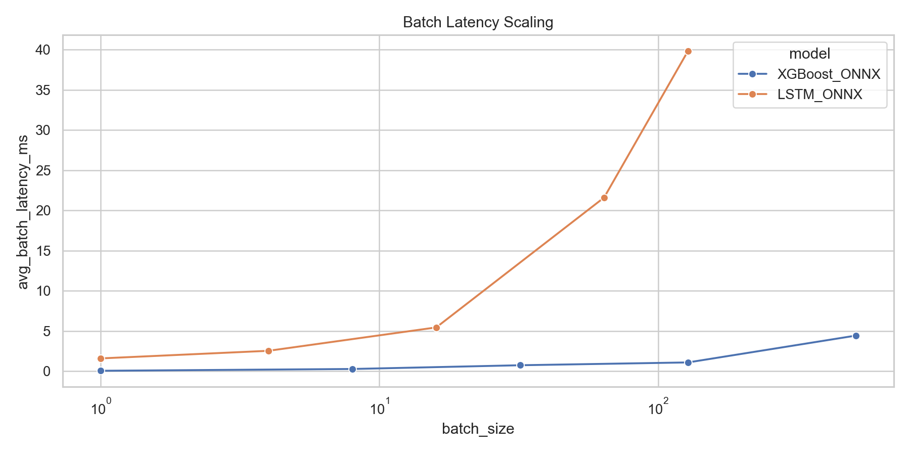
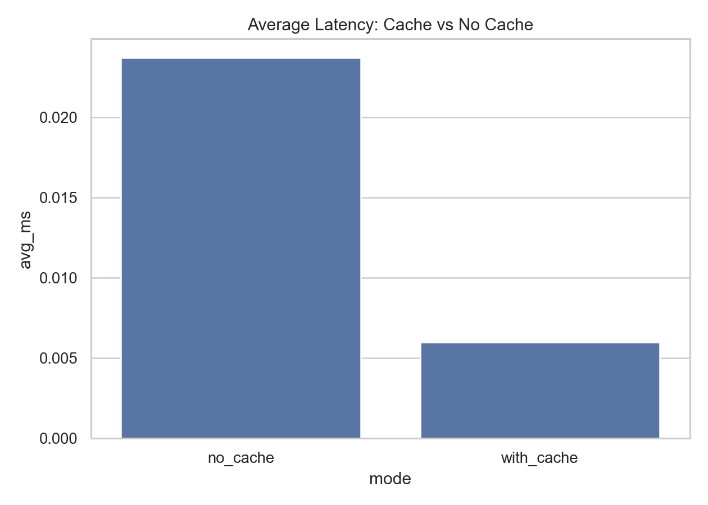
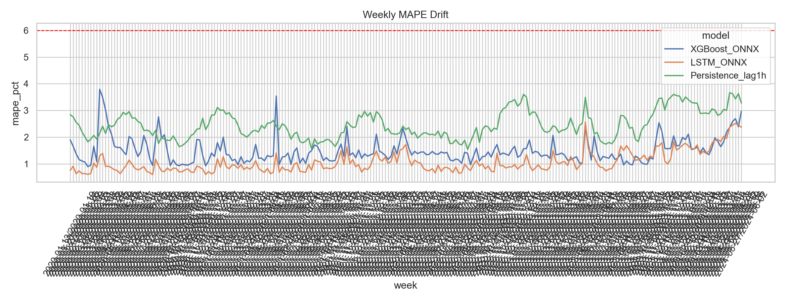
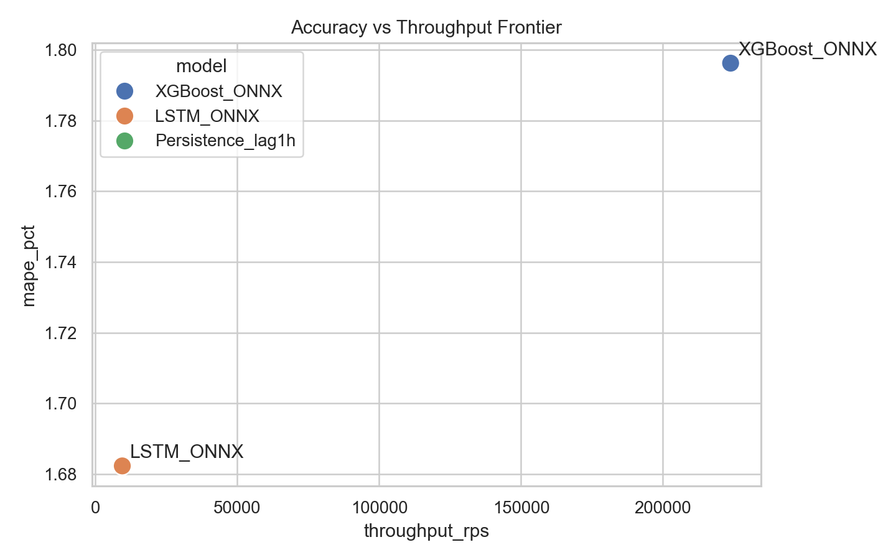
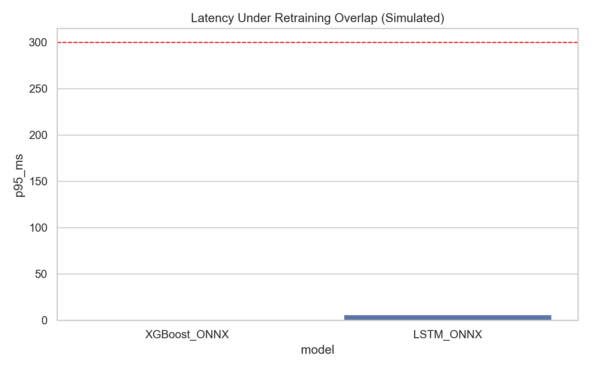

# Production Benchmarking Report for Gujarat Demand Models

## 1) Objective and Scope
This report implements the benchmarking intent of the production-readiness test plan using deployed artifacts:
- XGBoost ONNX: xgboost_model.onnx
- LSTM ONNX: final_lstm_model.onnx
- LSTM scalers: final_lstm_scalers.pkl

Walk-forward reserved range is excluded from all tests:
- Reserved period: 2024-06-01 00:00:00 to 2025-06-30 23:59:59
- Evaluated period only: 2020-01-01 00:00:00 to 2024-05-31 23:00:00

## 2) Dataset and Protocol Summary
- Source dataset: guarat_hourly_demand.csv
- Raw row count: 48191
- Rows after filtering to non-reserved horizon: 38711
- Rows after feature engineering and alignment: 38711
- Final synchronized benchmark rows: 38374
- Chronological split used for quality checks: 70% train / 15% validation / 15% test

## 3) Runtime Provider Configuration
- Available ONNX Runtime providers: AzureExecutionProvider, CPUExecutionProvider
- CUDA requested by benchmark: True
- CUDA provider available in runtime: False
- Effective provider order used for XGBoost: CPUExecutionProvider
- Effective provider order used for LSTM: CPUExecutionProvider

## 4) Plan Coverage Matrix
Implemented in this benchmark run:
- Inference latency, throughput, concurrency, burst and mixed payload profiles
- Cold start behavior
- Batch inference scaling
- Reliability under stress (error and timeout rates)
- Feature generation latency, validation overhead, cache effectiveness, backfill response
- Retry/timeout behavior
- Input robustness with malformed payloads
- Accuracy and drift windows (MAPE and Peak MAPE triggers)
- Resource profile proxy (wall time, CPU time ratio, memory trace, model size)

Intentionally deferred for later stage:
- Real walk-forward retraining strategy execution (Full Optuna, Warm Start, Fixed Param)
- Real online API benchmark with actual network stack and autoscaling platform

## 5) Accuracy and Forecast Quality (Reserved Horizon Excluded)
### 5.1 Main quality table
| split      | model             |   n_samples |     mae |    rmse |   mape_pct |   peak_mape_pct_top10 |       r2 |
|:-----------|:------------------|------------:|--------:|--------:|-----------:|----------------------:|---------:|
| test       | LSTM_ONNX         |        5757 | 299.151 | 422.775 |   1.68234  |              1.99403  | 0.97259  |
| test       | XGBoost_ONNX      |        5757 | 311.349 | 428.848 |   1.79624  |              1.66557  | 0.971797 |
| test       | Persistence_lag1h |        5757 | 557.397 | 726.027 |   3.16874  |              3.11779  | 0.919167 |
| train      | LSTM_ONNX         |       26861 | 132.435 | 191.63  |   0.911032 |              0.907518 | 0.99304  |
| train      | XGBoost_ONNX      |       26861 | 205.809 | 277.12  |   1.45733  |              1.07644  | 0.985444 |
| train      | Persistence_lag1h |       26861 | 340.055 | 449.827 |   2.33524  |              2.29195  | 0.961647 |
| validation | LSTM_ONNX         |        5756 | 197.741 | 320.091 |   1.15537  |              1.27507  | 0.976073 |
| validation | XGBoost_ONNX      |        5756 | 218.266 | 323.135 |   1.31376  |              0.667475 | 0.975615 |
| validation | Persistence_lag1h |        5756 | 395.316 | 514.148 |   2.29485  |              2.578    | 0.938266 |

### 5.2 Test-priority ranking (Peak MAPE first)
| model             |   mape_pct |   peak_mape_pct_top10 |    rmse |       r2 |
|:------------------|-----------:|----------------------:|--------:|---------:|
| XGBoost_ONNX      |    1.79624 |               1.66557 | 428.848 | 0.971797 |
| LSTM_ONNX         |    1.68234 |               1.99403 | 422.775 | 0.97259  |
| Persistence_lag1h |    3.16874 |               3.11779 | 726.027 | 0.919167 |

Winner by peak-sensitive rule: **XGBoost_ONNX**

## 6) Traffic Profiles and Latency Benchmark
### 6.1 Profile results (A/B/C/D)
| profile         | model        |   throughput_rps |   p50_ms |    p95_ms |    p99_ms |   error_rate_pct |   timeout_rate_pct |
|:----------------|:-------------|-----------------:|---------:|----------:|----------:|-----------------:|-------------------:|
| A_normal_steady | LSTM_ONNX    |         4616.35  |  1.3768  |  1.82583  |  2.08969  |                0 |                  0 |
| A_normal_steady | XGBoost_ONNX |       145075     |  0.0316  |  0.06796  |  0.132401 |                0 |                  0 |
| B_peak_traffic  | LSTM_ONNX    |         9277.73  |  1.3504  |  1.67256  |  1.92341  |                0 |                  0 |
| B_peak_traffic  | XGBoost_ONNX |       415858     |  0.0232  |  0.036805 |  0.057613 |                0 |                  0 |
| C_burst         | LSTM_ONNX    |         2863.1   |  2.36777 |  3.53259  |  4.14222  |                0 |                  0 |
| C_burst         | XGBoost_ONNX |        33528.8   |  0.15075 |  0.317382 |  0.355977 |                0 |                  0 |
| D_mixed_payload | LSTM_ONNX    |          561.843 |  3.4428  | 21.6558   | 24.3373   |                0 |                  0 |
| D_mixed_payload | XGBoost_ONNX |        21076     |  0.20665 |  0.582025 |  0.646306 |                0 |                  0 |

### 6.2 Retraining overlap profile (E, simulated CPU overlap)
| model        |   total_requests |   successful_requests |   concurrency | end_to_end   |   avg_request_size |   throughput_rps |   error_rate_pct |   timeout_rate_pct |   p50_ms |   p90_ms |   p95_ms |   p99_ms |   max_ms | profile              |
|:-------------|-----------------:|----------------------:|--------------:|:-------------|-------------------:|-----------------:|-----------------:|-------------------:|---------:|---------:|---------:|---------:|---------:|:---------------------|
| XGBoost_ONNX |              600 |                   600 |            10 | True         |              6.905 |         17465.3  |                0 |                  0 |  0.1845  |  0.59199 | 0.627905 | 0.693425 |   1.0343 | E_retraining_overlap |
| LSTM_ONNX    |              600 |                   600 |            10 | True         |              6.905 |          1624.01 |                0 |                  0 |  2.50045 |  5.65333 | 6.31433  | 7.36697  |  22.7811 | E_retraining_overlap |

## 7) Concurrency and Throughput Benchmark
| model        |   concurrency |   throughput_rps |   p95_ms |   p99_ms |   error_rate_pct |   timeout_rate_pct |
|:-------------|--------------:|-----------------:|---------:|---------:|-----------------:|-------------------:|
| LSTM_ONNX    |             1 |          591.377 | 2.35896  | 2.77639  |                0 |                  0 |
| LSTM_ONNX    |             2 |         1268.65  | 1.8358   | 2.12703  |                0 |                  0 |
| LSTM_ONNX    |             4 |         2524     | 1.70106  | 2.03025  |                0 |                  0 |
| LSTM_ONNX    |             8 |         4718.15  | 1.72855  | 2.01993  |                0 |                  0 |
| LSTM_ONNX    |            12 |         6928.79  | 1.71689  | 1.94444  |                0 |                  0 |
| LSTM_ONNX    |            16 |         9443.35  | 1.62919  | 1.92418  |                0 |                  0 |
| XGBoost_ONNX |             1 |        19874     | 0.109245 | 0.31837  |                0 |                  0 |
| XGBoost_ONNX |             2 |        47301     | 0.07402  | 0.128545 |                0 |                  0 |
| XGBoost_ONNX |             4 |        79190.4   | 0.07153  | 0.128215 |                0 |                  0 |
| XGBoost_ONNX |             8 |       143815     | 0.068585 | 0.109723 |                0 |                  0 |
| XGBoost_ONNX |            12 |       164468     | 0.07861  | 0.134701 |                0 |                  0 |
| XGBoost_ONNX |            16 |       223854     | 0.06173  | 0.13117  |                0 |                  0 |

## 8) Cold Start Benchmark
| model        |   model_load_ms |   first_prediction_ms |   cold_start_total_ms |
|:-------------|----------------:|----------------------:|----------------------:|
| LSTM_ONNX    |         50.5925 |               1.89646 |               52.4889 |
| XGBoost_ONNX |         52.4935 |               0.44862 |               52.9421 |

## 9) Batch Inference Benchmark
| model        |   batch_size |   avg_batch_latency_ms |   throughput_samples_per_sec |
|:-------------|-------------:|-----------------------:|-----------------------------:|
| LSTM_ONNX    |            1 |              1.60625   |                      622.568 |
| LSTM_ONNX    |            4 |              2.552     |                     1567.4   |
| LSTM_ONNX    |           16 |              5.46202   |                     2929.32  |
| LSTM_ONNX    |           64 |             21.6172    |                     2960.6   |
| LSTM_ONNX    |          128 |             39.8552    |                     3211.62  |
| XGBoost_ONNX |            1 |              0.0667667 |                    14977.5   |
| XGBoost_ONNX |            8 |              0.290333  |                    27554.5   |
| XGBoost_ONNX |           32 |              0.755433  |                    42359.8   |
| XGBoost_ONNX |          128 |              1.10515   |                   115821     |
| XGBoost_ONNX |          512 |              4.44293   |                   115239     |

## 10) Data and Feature Pipeline Benchmarks
### 10.1 Feature generation latency
| metric                 |   avg_ms |   p95_ms |
|:-----------------------|---------:|---------:|
| feature_generation_xgb | 0.148322 | 0.232075 |

### 10.2 Validation overhead
| path               |    avg_ms |   p95_ms |
|:-------------------|----------:|---------:|
| without_validation | 0.0290563 |  0.03312 |
| with_validation    | 0.0300027 |  0.03834 |

### 10.3 Cache effectiveness
| mode       |     avg_ms |   p95_ms |   cache_hit_ratio_pct |
|:-----------|-----------:|---------:|----------------------:|
| no_cache   | 0.0237033  |   0.0292 |                0      |
| with_cache | 0.00597317 |   0.0202 |               71.8333 |

### 10.4 Backfill behavior
|   requested_hours |   rows_available |   response_ms |
|------------------:|-----------------:|--------------:|
|                24 |               24 |        1.8383 |
|               168 |              168 |        2.5442 |
|               720 |              720 |        6.7936 |
|              2160 |             2160 |       13.9065 |

## 11) Timeout/Retry and Robustness Tests
### 11.1 Timeout and retry policy benchmark
| model        |   timeout_ms |   requests |   failed_after_retries |   failure_rate_pct |   total_retries_used |   p95_success_ms |
|:-------------|-------------:|-----------:|-----------------------:|-------------------:|---------------------:|-----------------:|
| XGBoost_ONNX |          400 |        400 |                      0 |                  0 |                    0 |          0.05209 |
| LSTM_ONNX    |          400 |        400 |                      0 |                  0 |                    0 |          1.55755 |

### 11.2 Malformed payload robustness
| case           | model        | accepted   | message                                                                                                       |
|:---------------|:-------------|:-----------|:--------------------------------------------------------------------------------------------------------------|
| missing_fields | XGBoost_ONNX | False      | [ONNXRuntimeError] : 2 : INVALID_ARGUMENT : Got invalid dimensions for input: input for the following indices |
| nan_values     | XGBoost_ONNX | True       | accepted                                                                                                      |
| wrong_dtype    | XGBoost_ONNX | False      | could not convert string to float: 'a'                                                                        |
| lstm_bad_shape | LSTM_ONNX    | False      | [ONNXRuntimeError] : 2 : INVALID_ARGUMENT : Got invalid dimensions for input: input for the following indices |

## 12) Drift and Stability Monitoring Windows
### 12.1 Weekly drift summary
| model             |   avg_mape_pct |   avg_peak_mape_pct |   mape_trigger_weeks |   peak_trigger_weeks |
|:------------------|---------------:|--------------------:|---------------------:|---------------------:|
| LSTM_ONNX         |        1.06467 |             1.09145 |                    0 |                    0 |
| XGBoost_ONNX      |        1.48906 |             1.21661 |                    0 |                    0 |
| Persistence_lag1h |        2.45576 |             2.13318 |                    0 |                    0 |

### 12.2 Trigger policy insight
- `trigger_mape_gt6`: number of weekly windows violating 6% MAPE retrain trigger
- `trigger_peak_mape_gt8`: number of weekly windows violating 8% Peak MAPE retrain trigger

## 13) Resource and Cost-Proxy Benchmark
| model        |   n_samples |   wall_time_sec |   cpu_time_sec |   cpu_to_wall_ratio |   peak_tracemalloc_mb |   model_file_mb |   est_cost_proxy_per_1k_samples_sec |
|:-------------|------------:|----------------:|---------------:|--------------------:|----------------------:|----------------:|------------------------------------:|
| XGBoost_ONNX |        2500 |       0.0118822 |            0   |             0       |              0.954348 |        0.920596 |                          0.00475288 |
| LSTM_ONNX    |         800 |       0.248146  |            1.5 |             6.04483 |             15.3907   |        1.09276  |                          0.310182   |

## 14) SLO Pass/Fail Gate Check
Threshold template used:
- p95 <= 300 ms
- p99 <= 600 ms
- error rate < 0.5% (normal)
- error rate < 2.0% (burst)
- cold start <= 2000 ms

| model        |   p95_ms | p95_pass   |   p99_ms | p99_pass   |   error_rate_normal_pct | error_normal_pass   |   error_rate_burst_pct | error_burst_pass   |   cold_start_ms | cold_start_pass   |
|:-------------|---------:|:-----------|---------:|:-----------|------------------------:|:--------------------|-----------------------:|:-------------------|----------------:|:------------------|
| LSTM_ONNX    |  1.82583 | True       | 2.08969  | True       |                       0 | True                |                      0 | True               |         52.4889 | True              |
| XGBoost_ONNX |  0.06796 | True       | 0.132401 | True       |                       0 | True                |                      0 | True               |         52.9421 | True              |

## 15) Graphs
- 
- 
- 
- 
- 
- 
- 
- 
- 

## 16) Interpretation and Deployment Guidance
1. If the chosen model passes forecast quality but fails p95/p99 under target concurrency, prioritize API optimization or model-serving changes before production rollout.
2. If cache hit ratio is high in realistic workloads, prediction/feature caching should be considered mandatory for latency control.
3. If overlap profile degrades p95 meaningfully, isolate retraining to separate compute or schedule retraining during low-traffic windows.
4. Track drift triggers weekly; use this report's trigger counts as baseline expectations for alert tuning.

## 17) Notes and Constraints
- Benchmark executed on local workstation context; results are representative for this environment, not a cloud SLO certification.
- Network, autoscaling, and multi-tenant fairness were approximated at application-model layer, not full cluster layer.
- CUDA is enabled when available and requested through BENCHMARK_USE_CUDA; otherwise the harness falls back to CPU providers.
- Walk-forward date range (June 2024 to June 2025) remains untouched as required for later-stage experiments.

---
Generated by benchmark/run_benchmark_suite.py
