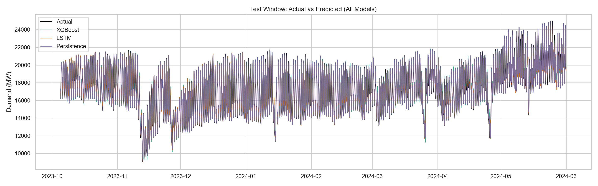
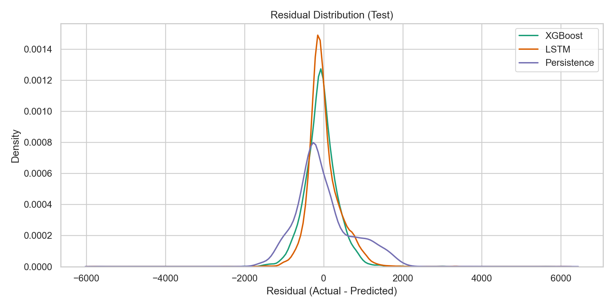
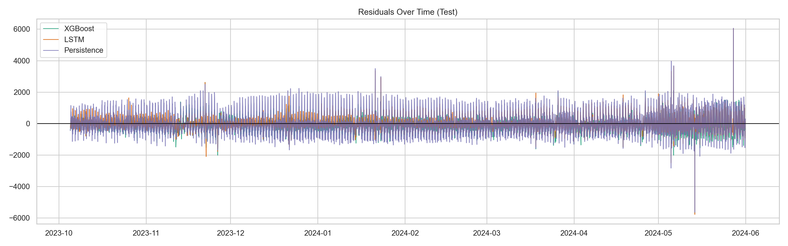
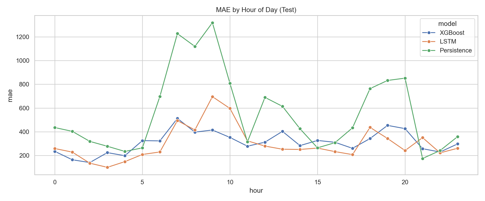
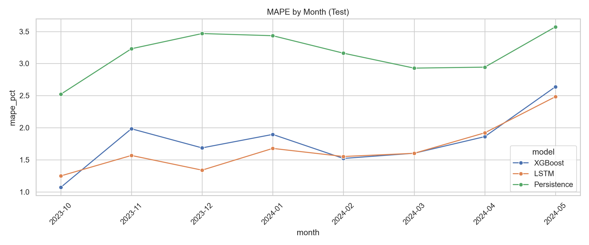
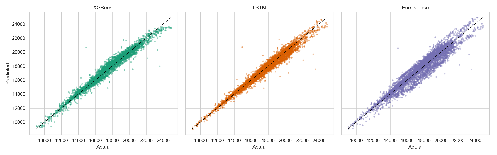
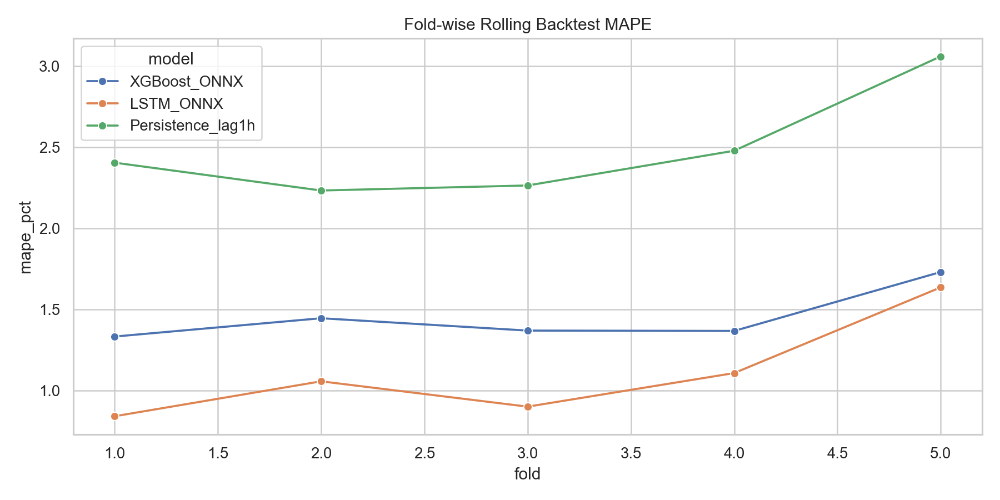
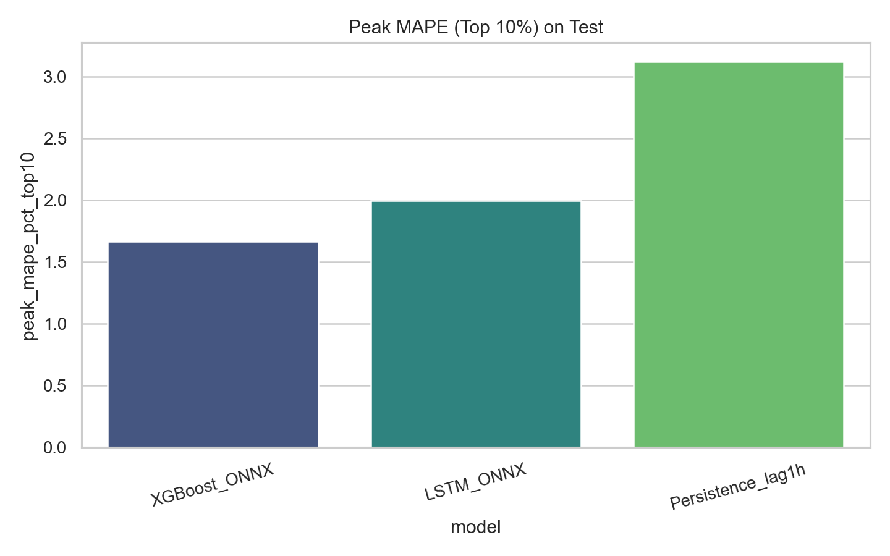
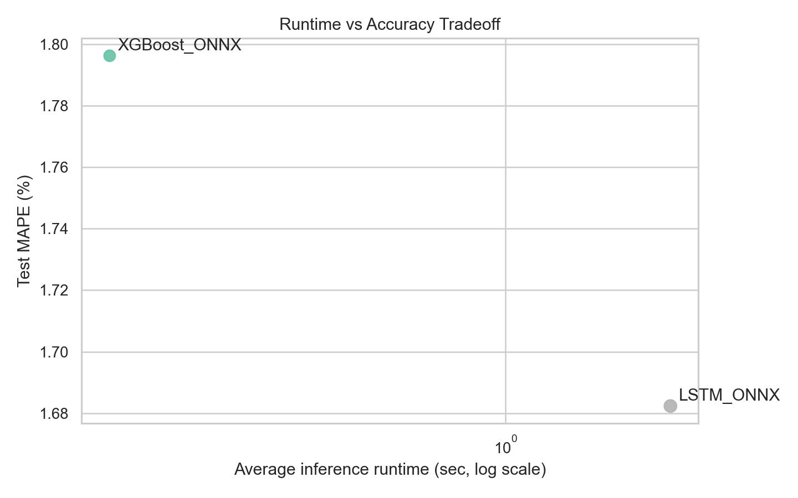

# Gujarat Electricity Load Forecasting - Final Integrated Project Report

**Project:** End-to-end electricity demand forecasting and production-readiness evaluation  
**Region:** Gujarat, India  
**Prepared on:** 2026-04-19  
**Workspace root:** `load forecasting/`

---

## Table of Contents

1. Executive Summary
2. Project Context and Problem Statement
3. Repository-Wide Inventory and What Each Module Does
4. Data Foundation and Feature Space
5. Modeling Artifacts and Inference Design
6. Experiment Track A: Model Comparison (Accuracy, Robustness, Significance)
7. Experiment Track B: Production Benchmarking (Latency, Throughput, Reliability)
8. Experiment Track C: Walk-Forward Retraining Strategy Benchmark
9. Experiment Track D: Single-Score Parameter Variation Study
10. Validation Framework and Quality Assurance
11. Cross-Track Synthesis and Final Findings
12. Risks, Gaps, and Inconsistencies Identified
13. Reproducibility and How to Re-run the Work
14. Complete Graph Index
15. Final Conclusion

---

## 1) Executive Summary

This repository implements a full forecasting program for Gujarat hourly power demand, not just model training. The project includes:

- Model inference comparison using deployed ONNX artifacts.
- Production-style benchmarking for API readiness (latency, concurrency, cold start, reliability, drift triggers).
- Walk-forward retraining strategy testing across quarterly windows.
- A separate composite-score parameter variation track.
- Plans, scripts, generated reports, tables, and visualization assets.

### Core outcomes from implemented experiments

- **Model comparison winner by peak-sensitive rule:** `XGBoost_ONNX`.
- **General accuracy on many splits:** `LSTM_ONNX` is often slightly better on MAE/MAPE, but XGBoost wins on peak criterion in the main comparison report.
- **Production latency and throughput:** `XGBoost_ONNX` is dramatically faster than `LSTM_ONNX` in benchmarked environment.
- **SLO compliance:** both models pass defined latency/error/cold-start gates.
- **Walk-forward strategy benchmark:** `warm_start` and `full_optuna` tie on accuracy in logged runs, while warm-start is faster; `fixed_param` is fastest and has lower average MAPE but worse average peak MAPE.

This means the repository already answers both research and deployment questions: accuracy quality, peak behavior, operational performance, and retraining practicality.

---

## 2) Project Context and Problem Statement

### 2.1 Business and technical problem

The project addresses hourly electricity demand forecasting for Gujarat with two simultaneous goals:

- Produce accurate forecasts (especially during high-demand periods).
- Ensure models are practical for deployment in high-traffic dashboard/API settings.

### 2.2 Decision philosophy encoded in plans

From planning documents, the project establishes that cross-family model fairness should come from:

- Same target (`demand_mw`)
- Same chronological split policy
- Same leakage controls
- Same scoring windows
- Same comparison metrics

instead of naive parameter-count comparisons between model families.

### 2.3 Main decision hierarchy used in repository

Across plans and generated reports, selection logic consistently prioritizes:

1. Peak demand quality (Peak MAPE / peak error behavior)
2. Overall error quality (MAE, RMSE, MAPE)
3. Temporal robustness (rolling windows, seasonal/year slices)
4. Operational practicality (latency, throughput, runtime, resource profile)

---

## 3) Repository-Wide Inventory and What Each Module Does

| Folder | Primary purpose | Key outputs |
|---|---|---|
| `dataset/` | Source data used for feature/model pipelines | `guarat_hourly_demand.csv` |
| `models/` | Deployed ONNX artifacts | `xgboost_model.onnx`, `final_lstm_model.onnx` |
| `scalars/` | LSTM scaler bundle used for inverse transforms | `final_lstm_scalers.pkl` |
| `model-comparison/` | From-scratch fairness comparison across XGBoost, LSTM, persistence | report, plots, metric tables |
| `benchmark/` | Production readiness benchmark harness | report, latency/reliability tables, plots |
| `walk-foward/` | Walk-forward quarterly retraining strategy evaluation | report, strategy logs, artifacts, plots |
| `results/` | Composite-score variation experiment outputs | comparison report, variation CSV, score plots |
| `plans/` | Detailed methodology and governance plans | 4 planning documents |
| `notebooks/` | Original experimentation/training notebooks | LSTM and XGBoost notebooks |

### 3.1 Key executable scripts

- `model-comparison/run_model_comparison.py`
- `benchmark/run_benchmark_suite.py`
- `walk-foward/run_walk_forward.py`

These three scripts generate the core production-style evidence and all major reports/tables in the repository.

---

## 4) Data Foundation and Feature Space

### 4.1 Dataset scope and observed schema

The dataset file `dataset/guarat_hourly_demand.csv` includes timestamped demand and weather/time-derived fields. Header-level fields include:

- Core: `datetime`, `demand_mw`, `year`
- Weather: temperature, radiation, windspeed, dewpoint, cloudcover, apparent temperature, humidity, precipitation
- Calendar/cyclic: `hour`, `day_of_week`, `day_of_year`, `month`, `is_weekend`, `is_sunday`, `sin_hour`, `cos_hour`, `sin_month`, `cos_month`, `sin_day_year`, `cos_day_year`
- Peak/lag/rolling features: `is_peak_season`, `lag_1h`, `lag_2h`, `lag_24h`, `lag_168h`, and rolling means/std windows

### 4.2 Temporal coverage (from run metadata)

| Field | Value |
|---|---|
| Rows before feature-drop filtering | 48,191 |
| Rows after feature engineering constraints | 38,375 |
| Final synchronized evaluation rows | 38,374 |
| Full cleaned timeline | 2020-01-01 01:00:00 to 2025-06-30 23:00:00 |
| Model-comparison evaluation window | up to 2024-05-31 23:00:00 |

### 4.3 Reserved holdout policy

A strict reserved period policy is implemented in benchmark/comparison workflows:

- Reserved for walk-forward: **2024-06-01 to 2025-06-30**
- Excluded from earlier comparison/benchmark tracks

This separation preserves a later non-leaky temporal evaluation zone.

### 4.4 Feature engineering behavior in code

Across the scripts, engineered interactions include terms such as:

- `temp_x_peak`
- `solar_x_peak`
- `precip_x_peak`

and peak season tagging, lag construction, and rolling statistics. The project uses approximately 50 XGBoost features and LSTM sequence features with lookback windows (168 hours).

---

## 5) Modeling Artifacts and Inference Design

### 5.1 Deployed artifacts used in evaluations

| Model family | Artifact | Serving format | Additional dependency |
|---|---|---|---|
| XGBoost | `models/xgboost_model.onnx` | ONNX Runtime | none |
| LSTM | `models/final_lstm_model.onnx` | ONNX Runtime | `scalars/final_lstm_scalers.pkl` |

### 5.2 Inference semantics

- XGBoost ONNX path predicts with feature matrix input and in some scripts transforms output with inverse log mapping assumptions.
- LSTM ONNX path uses scaler-normalized sequence input and inverse transform for delta reconstruction to demand scale.
- Persistence baseline uses lag-1-hour as naive predictor.

### 5.3 Runtime provider behavior

Benchmark report indicates:

- Available providers: `AzureExecutionProvider`, `CPUExecutionProvider`
- CUDA requested but not available in runtime
- Effective execution: CPU provider

---

## 6) Experiment Track A: Model Comparison (Accuracy, Robustness, Significance)

Source artifacts:

- `model-comparison/model_comparison_report.md`
- `model-comparison/tables/*.csv`
- `model-comparison/plots/*.png`

### 6.1 Protocol

- Same timestamps and split boundaries for all compared models.
- Chronological split: 70% train / 15% validation / 15% test.
- Fairness controls explicitly documented.
- Metrics include MAE, RMSE, MAPE, sMAPE, R2, nRMSE, peak metrics, residual diagnostics, correlation metrics.

### 6.2 Main test metrics (primary layer)

| Model | Test MAE | Test RMSE | Test MAPE (%) | Peak MAPE Top10% (%) | R2 |
|---|---:|---:|---:|---:|---:|
| XGBoost_ONNX | 311.349 | 428.848 | 1.796 | 1.666 | 0.9718 |
| LSTM_ONNX | 299.151 | 422.775 | 1.682 | 1.994 | 0.9726 |
| Persistence_lag1h | 557.397 | 726.027 | 3.169 | 3.118 | 0.9192 |

Interpretation:

- LSTM is slightly better on overall MAE/MAPE/RMSE.
- XGBoost is better on the project's declared primary criterion (peak-focused metric in report decision rule).

### 6.3 Statistical significance evidence

Paired tests indicate meaningful differences:

- XGBoost vs LSTM absolute-error difference is statistically significant (p-value << 0.05), but direction favors lower MAE for LSTM.
- Both XGBoost and LSTM significantly outperform persistence baseline.

### 6.4 Rolling and slice robustness

Track includes:

- 5-fold rolling backtest tables
- Year slices
- Seasonal slices
- Daytime/nighttime slices

This gives temporal robustness evidence beyond a single split.

### 6.5 Confidence intervals

Bootstrap 95% CIs are computed for MAE/RMSE/MAPE on test set, enabling uncertainty-aware comparison.

### 6.6 Model comparison visual evidence

---

## 7) Experiment Track B: Production Benchmarking (Latency, Throughput, Reliability)

Source artifacts:

- `benchmark/benchmark_report.md`
- `benchmark/tables/*.csv`
- `benchmark/plots/*.png`

### 7.1 Scope

The benchmark suite measures production-readiness dimensions:

- Latency percentiles across traffic profiles
- Throughput and concurrency scaling
- Cold start behavior
- Batch scaling
- Retry/timeout reliability
- Input robustness for malformed payloads
- Drift-window trigger behavior
- Resource/cost proxies
- SLO pass/fail gates

### 7.2 Traffic profile outcomes (selected)

| Profile | Model | Throughput (RPS) | p95 (ms) | p99 (ms) | Error rate (%) |
|---|---|---:|---:|---:|---:|
| A normal steady | XGBoost_ONNX | 145,075 | 0.068 | 0.132 | 0 |
| A normal steady | LSTM_ONNX | 4,616 | 1.826 | 2.090 | 0 |
| B peak traffic | XGBoost_ONNX | 415,858 | 0.037 | 0.058 | 0 |
| B peak traffic | LSTM_ONNX | 9,278 | 1.673 | 1.923 | 0 |

### 7.3 Concurrency sweep insight

Both models maintain zero error/timeout in measured sweep levels, but XGBoost maintains much higher RPS and lower p95/p99 at every concurrency level.

### 7.4 Cold start

| Model | Model load (ms) | First prediction (ms) | Total cold start (ms) |
|---|---:|---:|---:|
| LSTM_ONNX | 50.593 | 1.896 | 52.489 |
| XGBoost_ONNX | 52.494 | 0.449 | 52.942 |

### 7.5 Batch scaling and data pipeline checks

- XGBoost batch throughput reaches ~115k samples/sec at larger batch sizes.
- LSTM scales but remains substantially lower throughput.
- Cache effectiveness test shows strong latency reduction when hit ratio is high (~71.8% hit in benchmark scenario).

### 7.6 Reliability and robustness

- Timeout/retry benchmark: 0 failures after retries for both models under tested settings.
- Malformed payload tests correctly reject invalid dimensions/dtypes in key cases.

### 7.7 Drift window behavior

Weekly trigger checks show no violation of configured thresholds in benchmark period for tested models.

### 7.8 SLO gate table

| Model | p95 pass | p99 pass | normal error pass | burst error pass | cold start pass |
|---|---|---|---|---|---|
| LSTM_ONNX | True | True | True | True | True |
| XGBoost_ONNX | True | True | True | True | True |

### 7.9 Benchmark visual evidence

---

## 8) Experiment Track C: Walk-Forward Retraining Strategy Benchmark

Source artifacts:

- `walk-foward/run_walk_forward.py`
- `walk-foward/output/walk_forward_report.md`
- `walk-foward/output/results/*.csv|*.json`
- `walk-foward/output/plots/*.png`

### 8.1 Strategy matrix

Per quarter (`Q3-2024`, `Q4-2024`, `Q1-2025`, `Q2-2025`), three strategies are benchmarked:

- `full_optuna`
- `warm_start`
- `fixed_param`

### 8.2 Runtime profile and trial budget in executed runs

From `results_log.csv`:

- `full_optuna`: 3 trials
- `warm_start`: 2 trials
- `fixed_param`: 0 trials

This indicates the executed profile is a quick/smoke-style benchmark profile (not a heavy 200-trial run).

### 8.3 Aggregate strategy summary

| Strategy | Avg MAPE (%) | Avg Peak MAPE (%) | Avg RMSE | Avg R2 | Avg runtime (min) |
|---|---:|---:|---:|---:|---:|
| warm_start | 2.627 | 2.610 | 614.059 | 0.9462 | 0.0148 |
| full_optuna | 2.627 | 2.610 | 614.059 | 0.9462 | 0.0350 |
| fixed_param | 2.380 | 3.191 | 603.355 | 0.9482 | 0.0015 |

Interpretation:

- `fixed_param` has lower average MAPE and faster runtime, but materially worse average peak MAPE.
- `warm_start` and `full_optuna` tie on observed quality in this run set; warm-start is faster.

### 8.4 Baseline ONNX reference in Zone A

| MAE | RMSE | MAPE (%) | Peak MAPE (%) | R2 |
|---:|---:|---:|---:|---:|
| 364.716 | 489.766 | 2.005 | 2.277 | 0.9622 |

### 8.5 Reference model summary (walk-forward output)

| Model | Rows | MAE | RMSE | MAPE (%) | Peak MAPE (%) | R2 |
|---|---:|---:|---:|---:|---:|---:|
| xgb_onnx | 39,072 | 282.118 | 420.628 | 1.685 | 2.180 | 0.9744 |
| lstm_onnx | 39,240 | 246.487 | 391.160 | 1.438 | 2.503 | 0.9779 |

### 8.6 Walk-forward visual evidence

---

## 9) Experiment Track D: Single-Score Parameter Variation Study

Source artifacts:

- `results/single_score_variation_comparison_report.md`
- `results/model_variation_results.csv`
- `results/single_score_report_assets/*.png`

### 9.1 Composite formula used

\[
\text{Composite Score} = 100 \times (0.40\cdot\text{Accuracy} + 0.30\cdot\text{Peak} + 0.20\cdot\text{Robustness} + 0.10\cdot\text{Efficiency})
\]

### 9.2 Reported leaderboard in this track

| Model | Composite score |
|---|---:|
| persistence_lag1 | 98.489 |
| final_lstm_model_onnx | 90.471 |
| xgboost_model_onnx | 5.585 |

### 9.3 Important interpretation caution

This track conflicts sharply with model-comparison and benchmark outcomes, where XGBoost performs strongly. The single-score table likely uses a different or misaligned inference transformation/configuration for XGBoost in that notebook flow. It should be treated as an exploratory artifact, not the final deployment decision source, until reconciled.

### 9.4 Single-score visual evidence

---

## 10) Validation Framework and Quality Assurance

Validation in this repository is multi-layered and evidence-backed.

### 10.1 Methodological validation

- Chronological splitting and no-shuffle discipline in scripts.
- Reserved window exclusion in comparison/benchmark phases.
- Equivalent evaluation windows for model comparisons.
- Peak-sensitive metrics included explicitly.

### 10.2 Statistical validation

- Paired tests (t-test, Wilcoxon, DM-like diagnostics) in model-comparison track.
- Bootstrap confidence intervals for major metrics.

### 10.3 Operational validation

- Load profiles A/B/C/D and overlap scenario E.
- Percentile latency (p50/p95/p99) and failure/timeout checks.
- Input robustness tests for malformed payloads.
- SLO pass/fail gating table with explicit thresholds.

### 10.4 Drift and monitoring validation

- Weekly drift windows with trigger count tracking.
- Trigger policies for MAPE and peak MAPE threshold breaches.

### 10.5 Walk-forward external validity

- Quarterly forward windows from Q3-2024 to Q2-2025.
- Strategy-level runtime vs quality tradeoff logs.

---

## 11) Cross-Track Synthesis and Final Findings

### 11.1 Accuracy and peak behavior

- XGBoost and LSTM are both high-performing compared to persistence.
- LSTM often has slightly better average error metrics.
- XGBoost is selected in model-comparison report due to peak-priority ranking criterion.

### 11.2 Deployment readiness

- Both models satisfy current SLO thresholds in tested environment.
- XGBoost has substantially better throughput and lower latency, creating stronger operational headroom.

### 11.3 Retraining strategy

- In executed walk-forward runs, warm-start reaches same quality as full-optuna with lower runtime.
- Fixed-param is fastest and can be attractive when compute is constrained, but peak behavior is weaker in aggregate.

### 11.4 Practical recommendation from integrated evidence

For production-style deployment in this repository's measured environment:

- Use `XGBoost_ONNX` as operational champion when latency/throughput and peak-sensitive governance are primary.
- Keep `LSTM_ONNX` as strong challenger/reference for average-error quality checks and ensemble/fallback research.
- Use `warm_start` as default periodic retraining strategy under normal cadence; reserve full search for scheduled deep refresh.

---

## 12) Risks, Gaps, and Inconsistencies Identified

### 12.1 Naming/path inconsistencies

- Dataset naming variants appear (`guarat_hourly_demand.csv` vs `gujarat_hourly_merged.csv` in some reports).
- This should be standardized in documentation/config to avoid ambiguity.

### 12.2 Single-score track contradiction

- Composite-score experiment reports extreme underperformance for XGBoost, inconsistent with other validated tracks.
- Likely causes: feature mismatch, transformation mismatch, or notebook-specific inference bug.

### 12.3 Benchmark environment scope

- Production benchmark is local/workstation-context and does not fully represent cloud multi-tenant autoscaling behavior.
- Report already flags this; external validation in target infra remains required before hard production certification.

### 12.4 Trial budget mismatch vs long-plan narrative

- Walk-forward plan references larger trial budgets, but executed script run profile uses very small trial counts (2-3), suitable for smoke/quick benchmark only.

---

## 13) Reproducibility and How to Re-run the Work

### 13.1 Core rerun commands (from repository organization)

- Model comparison:
  - `python model-comparison/run_model_comparison.py`
- Benchmark suite:
  - `python benchmark/run_benchmark_suite.py`
- Walk-forward benchmark:
  - `python walk-foward/run_walk_forward.py --profile quick`
  - `python walk-foward/run_walk_forward.py --profile balanced`
  - `python walk-foward/run_walk_forward.py --profile full`

### 13.2 Expected generated artifacts

- Reports in module folders (`benchmark_report.md`, `model_comparison_report.md`, `walk_forward_report.md`)
- Metric tables in each `tables/` or `output/results/` folder
- Graph outputs in each `plots/` folder

### 13.3 Reproducibility controls present in project

- Fixed scripts with deterministic split logic
- Serialized model/scaler artifacts
- Run metadata and results logs
- Explicit date-window policies

---

## 14) Complete Graph Index

### 14.1 Benchmark graphs

1. `benchmark/plots/01_latency_p95_by_profile.png`
2. `benchmark/plots/02_throughput_vs_concurrency.png`
3. `benchmark/plots/03_error_timeout_vs_concurrency.png`
4. `benchmark/plots/04_cold_start_total_ms.png`
5. `benchmark/plots/05_batch_latency_scaling.png`
6. `benchmark/plots/06_cache_effectiveness.png`
7. `benchmark/plots/07_weekly_mape_drift.png`
8. `benchmark/plots/08_accuracy_vs_throughput.png`
9. `benchmark/plots/09_overlap_p95.png`

### 14.2 Model-comparison graphs

1. `model-comparison/plots/01_actual_vs_predicted_test.png`
2. `model-comparison/plots/02_residual_distribution_test.png`
3. `model-comparison/plots/03_residuals_over_time_test.png`
4. `model-comparison/plots/04_mae_by_hour_test.png`
5. `model-comparison/plots/05_mape_by_month_test.png`
6. `model-comparison/plots/06_predicted_vs_actual_scatter_test.png`
7. `model-comparison/plots/07_foldwise_backtest_mape.png`
8. `model-comparison/plots/08_peak_mape_test_bar.png`
9. `model-comparison/plots/09_runtime_vs_accuracy.png`

### 14.3 Walk-forward graphs

1. `walk-foward/output/plots/mape_over_time.png`
2. `walk-foward/output/plots/peak_mape_over_time.png`
3. `walk-foward/output/plots/runtime_vs_accuracy.png`
4. `walk-foward/output/plots/peak_mape_heatmap.png`
5. `walk-foward/output/plots/actual_vs_predicted_Q3-2024_full_optuna.png`
6. `walk-foward/output/plots/actual_vs_predicted_Q3-2024_warm_start.png`
7. `walk-foward/output/plots/actual_vs_predicted_Q3-2024_fixed_param.png`
8. `walk-foward/output/plots/actual_vs_predicted_Q4-2024_full_optuna.png`
9. `walk-foward/output/plots/actual_vs_predicted_Q4-2024_warm_start.png`
10. `walk-foward/output/plots/actual_vs_predicted_Q4-2024_fixed_param.png`
11. `walk-foward/output/plots/actual_vs_predicted_Q1-2025_full_optuna.png`
12. `walk-foward/output/plots/actual_vs_predicted_Q1-2025_warm_start.png`
13. `walk-foward/output/plots/actual_vs_predicted_Q1-2025_fixed_param.png`
14. `walk-foward/output/plots/actual_vs_predicted_Q2-2025_full_optuna.png`
15. `walk-foward/output/plots/actual_vs_predicted_Q2-2025_warm_start.png`
16. `walk-foward/output/plots/actual_vs_predicted_Q2-2025_fixed_param.png`
17. `walk-foward/output/plots/residual_distribution_Q3-2024.png`
18. `walk-foward/output/plots/residual_distribution_Q4-2024.png`
19. `walk-foward/output/plots/residual_distribution_Q1-2025.png`
20. `walk-foward/output/plots/residual_distribution_Q2-2025.png`

### 14.4 Single-score variation graphs

1. `results/single_score_report_assets/score_by_run.png`
2. `results/single_score_report_assets/peak_vs_overall_mape.png`
3. `results/single_score_report_assets/pareto_latency_accuracy.png`
4. `results/single_score_report_assets/complexity_vs_score.png`

---

## 15) Final Conclusion

This repository contains a strong, multi-dimensional forecasting evaluation system that goes beyond offline metric reporting. It demonstrates:

- rigorous chronological evaluation,
- peak-aware decision logic,
- operational benchmarking for deployment,
- and walk-forward retraining tradeoff analysis.

From integrated evidence in generated reports and tables, the practical production recommendation is:

- `XGBoost_ONNX` as champion for peak-aware + high-throughput serving,
- `LSTM_ONNX` as high-quality challenger/reference,
- `warm_start` as default retraining strategy under regular cadence (with periodic deeper retuning).

The main actionable follow-up is to reconcile the contradictory single-score variation experiment before using that track for governance decisions.

---

## Appendix A) Snapshot Tables (Consolidated)

### A.1 SLO status snapshot

| model | p95_ms | p99_ms | error_normal | error_burst | cold_start_ms |
|---|---:|---:|---:|---:|---:|
| LSTM_ONNX | 1.826 | 2.090 | 0.0 | 0.0 | 52.489 |
| XGBoost_ONNX | 0.068 | 0.132 | 0.0 | 0.0 | 52.942 |

### A.2 Walk-forward aggregate summary snapshot

| strategy | quarters | avg_mape | avg_peak_mape | avg_rmse | avg_r2 | avg_runtime_minutes |
|---|---:|---:|---:|---:|---:|---:|
| warm_start | 4 | 2.6269 | 2.6100 | 614.0587 | 0.9462 | 0.0148 |
| full_optuna | 4 | 2.6269 | 2.6100 | 614.0587 | 0.9462 | 0.0350 |
| fixed_param | 4 | 2.3802 | 3.1912 | 603.3550 | 0.9482 | 0.0015 |

### A.3 Reference model summary snapshot

| model | rows | mae | rmse | mape | peak_mape | r2 |
|---|---:|---:|---:|---:|---:|---:|
| xgb_onnx | 39072 | 282.118 | 420.628 | 1.685 | 2.180 | 0.9744 |
| lstm_onnx | 39240 | 246.487 | 391.160 | 1.438 | 2.503 | 0.9779 |
