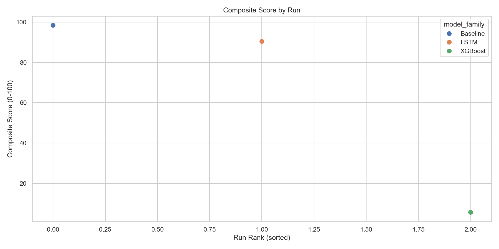
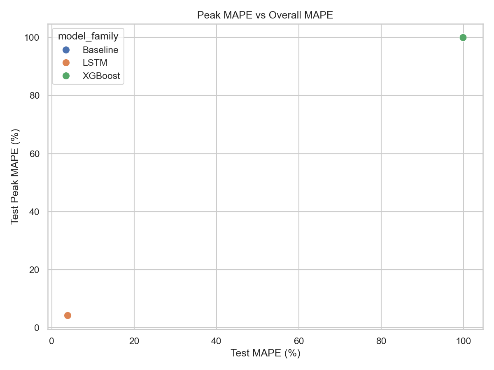
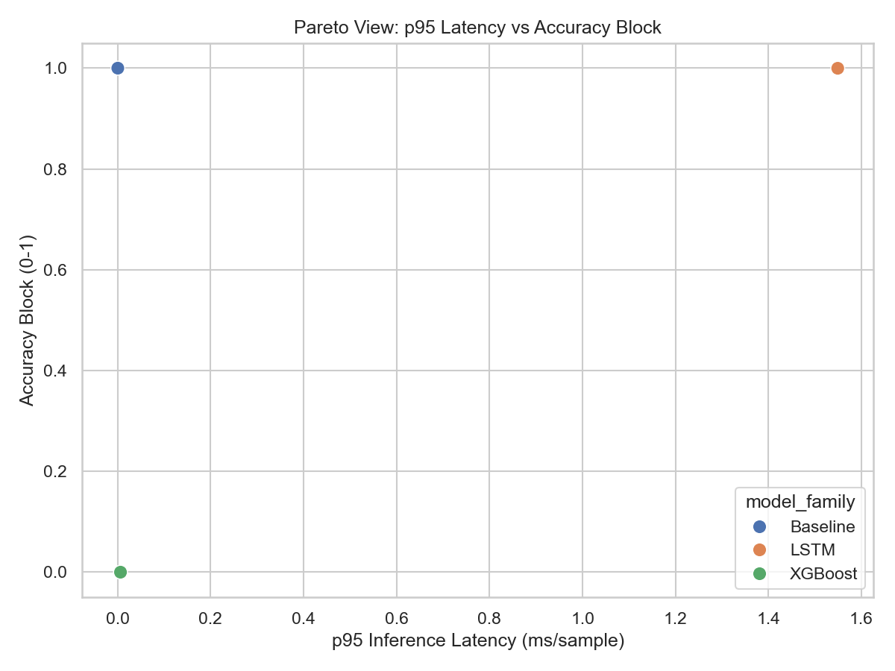
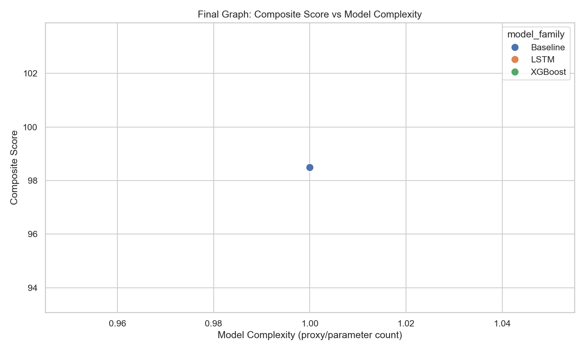

# Single-Score Variation Comparison Report

This report was generated by single_score_variation_comparsion.ipynb.

## 1. Experiment Setup
- Models compared: Baseline, XGBoost (ONNX), LSTM (ONNX)
- Artifact usage: pretrained models from /models and scaler bundle from /scalars
- Split policy: chronological 70% train / 15% validation / 15% test
- Composite strategy: weighted Accuracy, Peak, Robustness, Efficiency blocks
- Composite scale: 0 to 100 (higher is better)

## 2. Composite Scoring Formula
Composite Score = 100 * (0.40 * Accuracy + 0.30 * Peak + 0.20 * Robustness + 0.10 * Efficiency)

Accuracy block internals: 0.25 MAE + 0.25 RMSE + 0.25 MAPE + 0.25 R2 (normalized)
Peak block internals: 0.70 Peak MAPE + 0.30 Peak MAE (normalized)
Robustness block internals: mean of normalized fold mean/worst/std RMSE
Efficiency block internals: 0.40 p95 latency + 0.30 throughput + 0.30 train time (normalized)

## 3. Leaderboard (Top 20)
| model_family   | model_name            |   composite_score |   accuracy_block |   peak_block |   robustness_block |   efficiency_block |    test_R2 |   test_MAPE |   test_Peak_MAPE |   infer_p95_latency_ms |   throughput_rps |   complexity |
|:---------------|:----------------------|------------------:|-----------------:|-------------:|-------------------:|-------------------:|-----------:|------------:|-----------------:|-----------------------:|-----------------:|-------------:|
| Baseline       | persistence_lag1      |          98.4892  |         1        |      0.99964 |           1        |           0.85     |   0.898923 |     3.81804 |          4.28165 |               0.000376 |      6.00784e+06 |            1 |
| LSTM           | final_lstm_model_onnx |          90.4709  |         0.999763 |      1       |           0.949017 |           0.15     |   0.898767 |     3.86481 |          4.24745 |               1.54916  |   1162.29        |          nan |
| XGBoost        | xgboost_model_onnx    |           5.58491 |         0        |      0       |           0        |           0.558492 | -36.9099   |    99.9445  |         99.9569  |               0.00618  | 201198           |          nan |

## 4. Full Results Table (All Runs)
| model_family   | model_name            | params                                                                                 |   complexity |   composite_score |   accuracy_block |   peak_block |   robustness_block |   efficiency_block |   train_MAE |   train_RMSE |   train_MAPE |   train_R2 |   val_MAE |   val_RMSE |   val_MAPE |     val_R2 |   test_MAE |   test_RMSE |   test_MAPE |    test_R2 |   test_Peak_MAE |   test_Peak_MAPE |   test_Peak_Count |   robust_mean_rmse |   robust_worst_rmse |   robust_std_rmse |   train_time_sec |   infer_latency_ms |   infer_p95_latency_ms |   throughput_rps |   seed | data_path                 | split_policy           |
|:---------------|:----------------------|:---------------------------------------------------------------------------------------|-------------:|------------------:|-----------------:|-------------:|-------------------:|-------------------:|------------:|-------------:|-------------:|-----------:|----------:|-----------:|-----------:|-----------:|-----------:|------------:|------------:|-----------:|----------------:|-----------------:|------------------:|-------------------:|--------------------:|------------------:|-----------------:|-------------------:|-----------------------:|-----------------:|-------:|:--------------------------|:-----------------------|
| Baseline       | persistence_lag1      | {'type': 'lag_1h'}                                                                     |            1 |          98.4892  |         1        |      0.99964 |           1        |           0.85     |     353.097 |      465.619 |      2.33727 |   0.965364 |   537.256 |    706.635 |    3.04877 |   0.927206 |    702.564 |     944.953 |     3.81804 |   0.898923 |         991.186 |          4.28165 |               721 |            539.122 |              656.05 |           89.6052 |                0 |           0.000126 |               0.000376 |      6.00784e+06 |     42 | gujarat_hourly_merged.csv | chronological_70_15_15 |
| LSTM           | final_lstm_model_onnx | {'artifact': 'final_lstm_model.onnx', 'lookback': 168, 'mode': 'pretrained_inference'} |          nan |          90.4709  |         0.999763 |      1       |           0.949017 |           0.15     |     356.625 |      466.584 |      2.36368 |   0.965204 |   543.962 |    707.441 |    3.09395 |   0.92704  |    709.796 |     945.683 |     3.86481 |   0.898767 |         983.02  |          4.24745 |               721 |            929.681 |             1151.02 |          173.377  |                0 |           0.879435 |               1.54916  |   1162.29        |     42 | gujarat_hourly_merged.csv | chronological_70_15_15 |
| XGBoost        | xgboost_model_onnx    | {'artifact': 'xgboost_model.onnx', 'mode': 'pretrained_inference'}                     |          nan |           5.58491 |         0        |      0       |           0        |           0.558492 |   15009.3   |    15216.3   |     99.9345  | -35.9898   | 17252.4   |  17450     |   99.9424  | -43.391    |  18057.5   |   18300.4   |    99.9445  | -36.9099   |       23221.8   |         99.9569  |               721 |          16328.4   |            17478    |          937.601  |                0 |           0.0055   |               0.00618  | 201198           |     42 | gujarat_hourly_merged.csv | chronological_70_15_15 |

## 5. Family-Wise Summary (Mean)
| model_family   |   composite_score |   accuracy_block |   peak_block |   robustness_block |   efficiency_block |    test_R2 |   test_MAPE |   test_Peak_MAPE |   infer_latency_ms |   infer_p95_latency_ms |   throughput_rps |   train_time_sec |
|:---------------|------------------:|-----------------:|-------------:|-------------------:|-------------------:|-----------:|------------:|-----------------:|-------------------:|-----------------------:|-----------------:|-----------------:|
| Baseline       |          98.4892  |         1        |      0.99964 |           1        |           0.85     |   0.898923 |     3.81804 |          4.28165 |           0.000126 |               0.000376 |      6.00784e+06 |                0 |
| LSTM           |          90.4709  |         0.999763 |      1       |           0.949017 |           0.15     |   0.898767 |     3.86481 |          4.24745 |           0.879435 |               1.54916  |   1162.29        |                0 |
| XGBoost        |           5.58491 |         0        |      0       |           0        |           0.558492 | -36.9099   |    99.9445  |         99.9569  |           0.0055   |               0.00618  | 201198           |                0 |

## 6. Best Configuration per Model Family
| model_family   | model_name            | params                                                                                 |   composite_score |    test_R2 |   test_MAPE |   test_Peak_MAPE |   infer_p95_latency_ms |   throughput_rps |   complexity |
|:---------------|:----------------------|:---------------------------------------------------------------------------------------|------------------:|-----------:|------------:|-----------------:|-----------------------:|-----------------:|-------------:|
| Baseline       | persistence_lag1      | {'type': 'lag_1h'}                                                                     |          98.4892  |   0.898923 |     3.81804 |          4.28165 |               0.000376 |      6.00784e+06 |            1 |
| LSTM           | final_lstm_model_onnx | {'artifact': 'final_lstm_model.onnx', 'lookback': 168, 'mode': 'pretrained_inference'} |          90.4709  |   0.898767 |     3.86481 |          4.24745 |               1.54916  |   1162.29        |          nan |
| XGBoost        | xgboost_model_onnx    | {'artifact': 'xgboost_model.onnx', 'mode': 'pretrained_inference'}                     |           5.58491 | -36.9099   |    99.9445  |         99.9569  |               0.00618  | 201198           |          nan |

## 7. Graphs
### Composite Score by Run

### Peak vs Overall MAPE

### Pareto: Latency vs Accuracy Block

### Final Graph: Composite Score vs Model Complexity

## 8. Final Interpretation
The final graph (Composite Score vs Model Complexity) shows score movement with complexity. Use this with peak metrics and p95 latency gates for deployment selection.
