# Gujarat Walk-Forward Retraining Report

## 1. Scope
This report documents the walk-forward benchmark implemented in `load forecasting/walk-foward`. The fixed-param strategy uses the stored ONNX artifact from `/models`, while the competing retraining strategies fit fresh XGBoost models with Optuna tuning.

## 2. Test Matrix
| test                      | status   | details                                                                                                                                                                                                                                  |
|:--------------------------|:---------|:-----------------------------------------------------------------------------------------------------------------------------------------------------------------------------------------------------------------------------------------|
| dataset_presence          | pass     | D:\project course\gujarat_hourly_merged.csv                                                                                                                                                                                              |
| onnx_fixed_model_presence | pass     | D:\project course\load forecasting\models\xgboost_model.onnx                                                                                                                                                                             |
| onnx_lstm_model_presence  | pass     | D:\project course\load forecasting\models\final_lstm_model.onnx                                                                                                                                                                          |
| scaler_presence           | pass     | D:\project course\load forecasting\scalars\final_lstm_scalers.pkl                                                                                                                                                                        |
| baseline_zone_a_score     | pass     | {"mae": 364.7161320393254, "rmse": 489.7660384897574, "mape": 2.0048694463918384, "peak_mape": 2.2771087133673396, "r2": 0.9621587334854367, "peak_count": 455, "residual_mean": -62.03692397631677, "residual_std": 485.82115281398285} |
| walk_forward_runs         | pass     | 12 run rows                                                                                                                                                                                                                              |
| plot_generation           | pass     | 20 plots                                                                                                                                                                                                                                 |
| report_generation         | pass     | D:\project course\load forecasting\walk-foward\output\walk_forward_report.md                                                                                                                                                             |

## 3. Dataset Coverage
- Baseline zone: 2021-01-01 00:00:00 to 2024-06-30 23:00:00
- Prediction horizon: 2024-07-01 00:00:00 to 2025-06-30 23:00:00
- Baseline test rows: 4547

## 4. Baseline ONNX Reference
|     mae |    rmse |    mape |   peak_mape |       r2 |   peak_count |   residual_mean |   residual_std |
|--------:|--------:|--------:|------------:|---------:|-------------:|----------------:|---------------:|
| 364.716 | 489.766 | 2.00487 |     2.27711 | 0.962159 |          455 |        -62.0369 |        485.821 |

## 5. Primary Walk-Forward Results
| run_id              | quarter   | strategy    | train_start         | train_end           |   n_train_rows |   n_predict_rows |   optuna_trials |   runtime_minutes |   best_n_estimators |   test_r2 |   test_mae |   test_rmse |   test_mape |   test_peak_mape |   peak_count | best_params_json                                                                                                                                                                                                                                                                                               | notes                                                              | model_path                                                                                         |
|:--------------------|:----------|:------------|:--------------------|:--------------------|---------------:|-----------------:|----------------:|------------------:|--------------------:|----------:|-----------:|------------:|------------:|-----------------:|-------------:|:---------------------------------------------------------------------------------------------------------------------------------------------------------------------------------------------------------------------------------------------------------------------------------------------------------------|:-------------------------------------------------------------------|:---------------------------------------------------------------------------------------------------|
| Q1-2025_fixed_param | Q1-2025   | fixed_param | 2021-01-15 00:00:00 | 2024-12-31 23:00:00 |          34728 |             2160 |               0 |        0.00165228 |                   0 |  0.938274 |    548.697 |     797.394 |     3.01402 |          3.25259 |          216 | {"artifact": "xgboost_model.onnx", "mode": "fixed_param_reference"}                                                                                                                                                                                                                                            | Stored ONNX model reused without hyperparameter search.            | D:\project course\load forecasting\models\xgboost_model.onnx                                       |
| Q1-2025_full_optuna | Q1-2025   | full_optuna | 2021-01-15 00:00:00 | 2024-12-31 23:00:00 |          34728 |             2160 |               3 |        0.0453002  |                 120 |  0.94895  |    527.91  |     725.166 |     2.95924 |          2.76515 |          216 | {"max_depth": 5, "learning_rate": 0.24517932047070642, "subsample": 0.8659969709057025, "colsample_bytree": 0.759195090518222, "min_child_weight": 4, "gamma": 0.7799726016810132, "reg_alpha": 3.3323645788192616e-08, "reg_lambda": 0.6245760287469893, "n_estimators": 120, "inner_best_n_estimators": 182} | Fresh Optuna search. Final booster rounds were capped for runtime. | D:\project course\load forecasting\walk-foward\output\artifacts\Q1-2025\full_optuna\xgb_model.json |
| Q1-2025_warm_start  | Q1-2025   | warm_start  | 2021-01-15 00:00:00 | 2024-12-31 23:00:00 |          34728 |             2160 |               2 |        0.0165147  |                 120 |  0.94895  |    527.91  |     725.166 |     2.95924 |          2.76515 |          216 | {"max_depth": 5, "learning_rate": 0.24517932047070642, "subsample": 0.8659969709057025, "colsample_bytree": 0.759195090518222, "min_child_weight": 4, "gamma": 0.7799726016810132, "reg_alpha": 3.3323645788192616e-08, "reg_lambda": 0.6245760287469893, "n_estimators": 120, "inner_best_n_estimators": 120} | Warm-start used prior params as an enqueued trial.                 | D:\project course\load forecasting\walk-foward\output\artifacts\Q1-2025\warm_start\xgb_model.json  |
| Q2-2025_fixed_param | Q2-2025   | fixed_param | 2021-01-15 00:00:00 | 2025-03-31 23:00:00 |          36888 |             2184 |               0 |        0.00181418 |                   0 |  0.919236 |    547.886 |     766.284 |     2.76413 |          5.359   |          219 | {"artifact": "xgboost_model.onnx", "mode": "fixed_param_reference"}                                                                                                                                                                                                                                            | Stored ONNX model reused without hyperparameter search.            | D:\project course\load forecasting\models\xgboost_model.onnx                                       |
| Q2-2025_full_optuna | Q2-2025   | full_optuna | 2021-01-15 00:00:00 | 2025-03-31 23:00:00 |          36888 |             2184 |               3 |        0.0483716  |                 120 |  0.932633 |    536.166 |     699.847 |     2.81559 |          3.22658 |          219 | {"max_depth": 5, "learning_rate": 0.24517932047070642, "subsample": 0.8659969709057025, "colsample_bytree": 0.759195090518222, "min_child_weight": 4, "gamma": 0.7799726016810132, "reg_alpha": 3.3323645788192616e-08, "reg_lambda": 0.6245760287469893, "n_estimators": 120, "inner_best_n_estimators": 182} | Fresh Optuna search. Final booster rounds were capped for runtime. | D:\project course\load forecasting\walk-foward\output\artifacts\Q2-2025\full_optuna\xgb_model.json |
| Q2-2025_warm_start  | Q2-2025   | warm_start  | 2021-01-15 00:00:00 | 2025-03-31 23:00:00 |          36888 |             2184 |               2 |        0.0235431  |                 120 |  0.932633 |    536.166 |     699.847 |     2.81559 |          3.22658 |          219 | {"max_depth": 5, "learning_rate": 0.24517932047070642, "subsample": 0.8659969709057025, "colsample_bytree": 0.759195090518222, "min_child_weight": 4, "gamma": 0.7799726016810132, "reg_alpha": 3.3323645788192616e-08, "reg_lambda": 0.6245760287469893, "n_estimators": 120, "inner_best_n_estimators": 120} | Warm-start used prior params as an enqueued trial.                 | D:\project course\load forecasting\walk-foward\output\artifacts\Q2-2025\warm_start\xgb_model.json  |
| Q3-2024_fixed_param | Q3-2024   | fixed_param | 2021-01-15 00:00:00 | 2024-06-30 23:00:00 |          30312 |             2208 |               0 |        0.00117016 |                   0 |  0.969028 |    271.294 |     353.247 |     1.64029 |          1.65669 |          221 | {"artifact": "xgboost_model.onnx", "mode": "fixed_param_reference"}                                                                                                                                                                                                                                            | Stored ONNX model reused without hyperparameter search.            | D:\project course\load forecasting\models\xgboost_model.onnx                                       |
| Q3-2024_full_optuna | Q3-2024   | full_optuna | 2021-01-15 00:00:00 | 2024-06-30 23:00:00 |          30312 |             2208 |               3 |        0.0233147  |                 120 |  0.947429 |    350.663 |     460.221 |     2.11144 |          2.25302 |          221 | {"max_depth": 5, "learning_rate": 0.24517932047070642, "subsample": 0.8659969709057025, "colsample_bytree": 0.759195090518222, "min_child_weight": 4, "gamma": 0.7799726016810132, "reg_alpha": 3.3323645788192616e-08, "reg_lambda": 0.6245760287469893, "n_estimators": 120, "inner_best_n_estimators": 182} | Fresh Optuna search. Final booster rounds were capped for runtime. | D:\project course\load forecasting\walk-foward\output\artifacts\Q3-2024\full_optuna\xgb_model.json |
| Q3-2024_warm_start  | Q3-2024   | warm_start  | 2021-01-15 00:00:00 | 2024-06-30 23:00:00 |          30312 |             2208 |               2 |        0.00936443 |                 120 |  0.947429 |    350.663 |     460.221 |     2.11144 |          2.25302 |          221 | {"max_depth": 5, "learning_rate": 0.24517932047070642, "subsample": 0.8659969709057025, "colsample_bytree": 0.759195090518222, "min_child_weight": 4, "gamma": 0.7799726016810132, "reg_alpha": 3.3323645788192616e-08, "reg_lambda": 0.6245760287469893, "n_estimators": 120, "inner_best_n_estimators": 120} | Warm-start used prior params as an enqueued trial.                 | D:\project course\load forecasting\walk-foward\output\artifacts\Q3-2024\warm_start\xgb_model.json  |
| Q4-2024_fixed_param | Q4-2024   | fixed_param | 2021-01-15 00:00:00 | 2024-09-30 23:00:00 |          32520 |             2208 |               0 |        0.00151319 |                   0 |  0.96643  |    358.28  |     496.495 |     2.10225 |          2.49664 |          221 | {"artifact": "xgboost_model.onnx", "mode": "fixed_param_reference"}                                                                                                                                                                                                                                            | Stored ONNX model reused without hyperparameter search.            | D:\project course\load forecasting\models\xgboost_model.onnx                                       |
| Q4-2024_full_optuna | Q4-2024   | full_optuna | 2021-01-15 00:00:00 | 2024-09-30 23:00:00 |          32520 |             2208 |               3 |        0.0229073  |                 120 |  0.955598 |    437.039 |     571.001 |     2.62128 |          2.19526 |          221 | {"max_depth": 5, "learning_rate": 0.24517932047070642, "subsample": 0.8659969709057025, "colsample_bytree": 0.759195090518222, "min_child_weight": 4, "gamma": 0.7799726016810132, "reg_alpha": 3.3323645788192616e-08, "reg_lambda": 0.6245760287469893, "n_estimators": 120, "inner_best_n_estimators": 182} | Fresh Optuna search. Final booster rounds were capped for runtime. | D:\project course\load forecasting\walk-foward\output\artifacts\Q4-2024\full_optuna\xgb_model.json |
| Q4-2024_warm_start  | Q4-2024   | warm_start  | 2021-01-15 00:00:00 | 2024-09-30 23:00:00 |          32520 |             2208 |               2 |        0.00980303 |                 120 |  0.955598 |    437.039 |     571.001 |     2.62128 |          2.19526 |          221 | {"max_depth": 5, "learning_rate": 0.24517932047070642, "subsample": 0.8659969709057025, "colsample_bytree": 0.759195090518222, "min_child_weight": 4, "gamma": 0.7799726016810132, "reg_alpha": 3.3323645788192616e-08, "reg_lambda": 0.6245760287469893, "n_estimators": 120, "inner_best_n_estimators": 120} | Warm-start used prior params as an enqueued trial.                 | D:\project course\load forecasting\walk-foward\output\artifacts\Q4-2024\warm_start\xgb_model.json  |

## 6. Aggregate Strategy Summary
| strategy    |   quarters |   avg_mape |   avg_peak_mape |   avg_rmse |   avg_r2 |   avg_runtime_minutes |   avg_n_estimators |
|:------------|-----------:|-----------:|----------------:|-----------:|---------:|----------------------:|-------------------:|
| warm_start  |          4 |    2.62689 |         2.61    |    614.059 | 0.946153 |            0.0148063  |                120 |
| full_optuna |          4 |    2.62689 |         2.61    |    614.059 | 0.946153 |            0.0349735  |                120 |
| fixed_param |          4 |    2.38017 |         3.19123 |    603.355 | 0.948242 |            0.00153745 |                  0 |

## 7. Reference Model Summary
| model    |   rows |     mae |    rmse |   mape |   peak_mape |       r2 |   peak_count |
|:---------|-------:|--------:|--------:|-------:|------------:|---------:|-------------:|
| xgb_onnx |  39072 | 282.118 | 420.628 | 1.6851 |     2.18004 | 0.974411 |         3909 |

## 8. LSTM Reference Summary
| model     |   rows |     mae |   rmse |    mape |   peak_mape |       r2 |   peak_count |
|:----------|-------:|--------:|-------:|--------:|------------:|---------:|-------------:|
| lstm_onnx |  39240 | 246.487 | 391.16 | 1.43774 |     2.50322 | 0.977909 |         3924 |

## 9. Plots
- 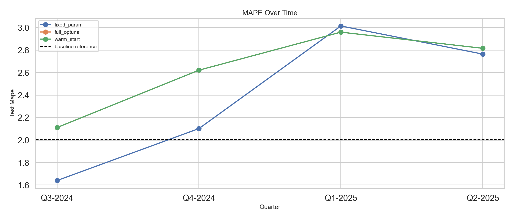
- 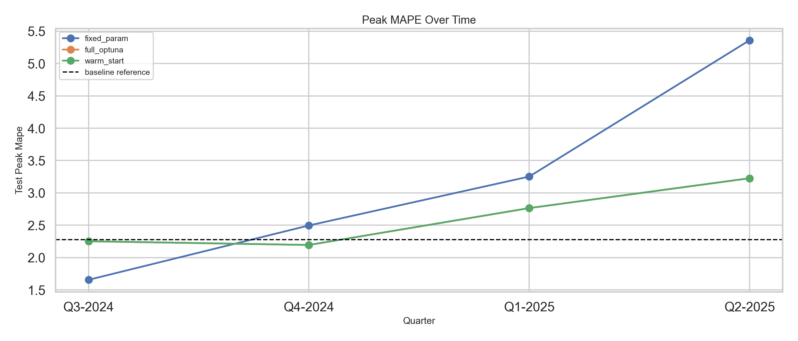
- 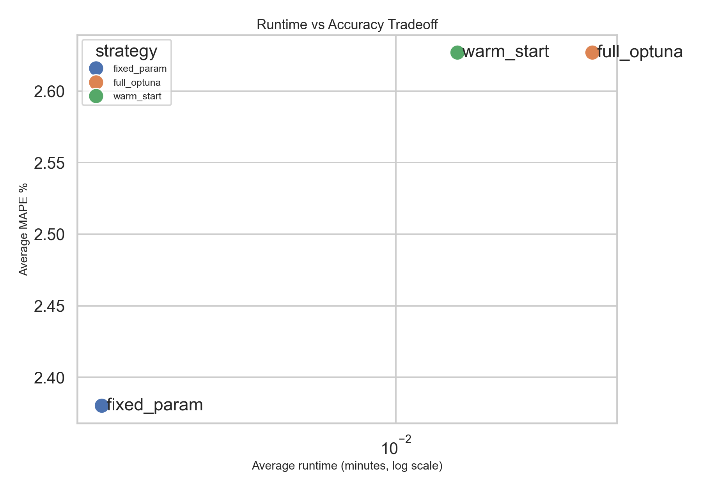
- 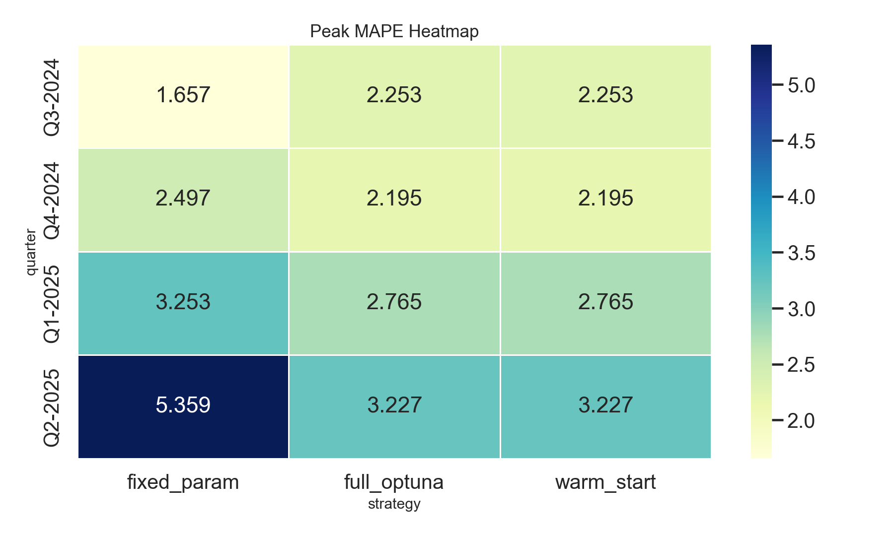
- 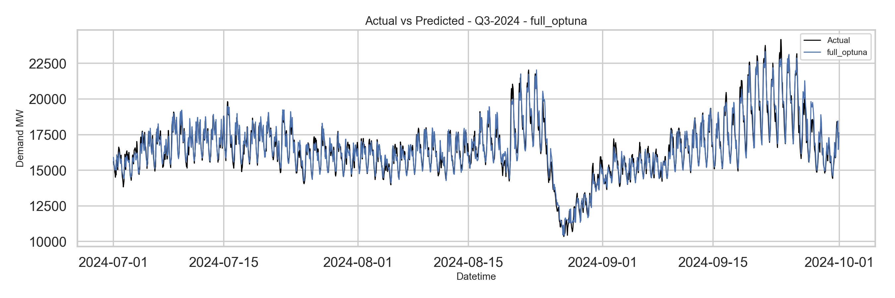
- 
- 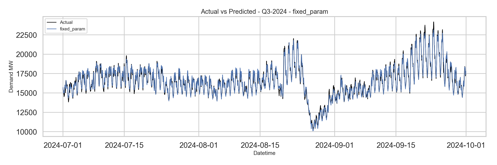
- 
- 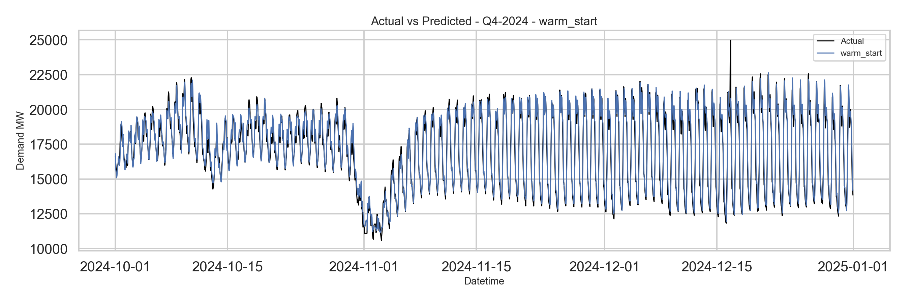
- 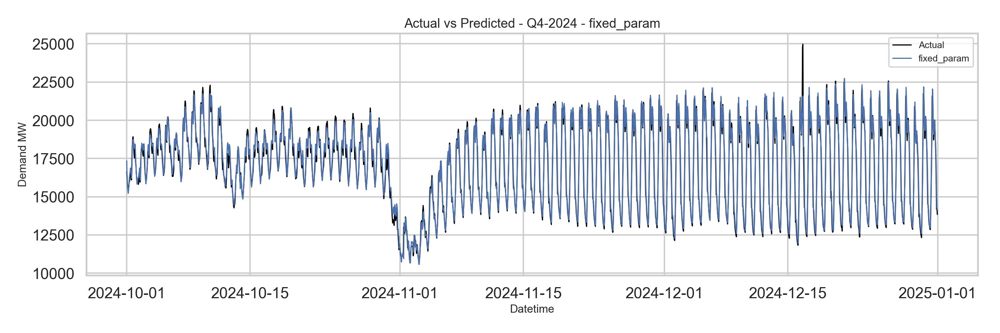
- 
- 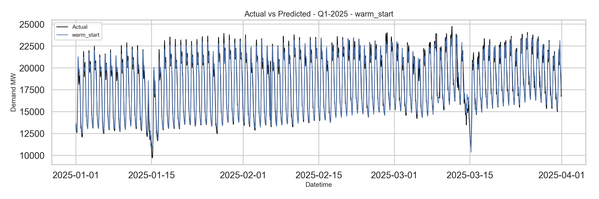
- 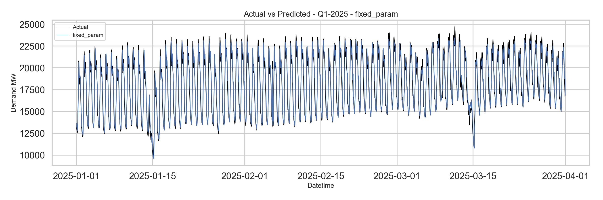
- 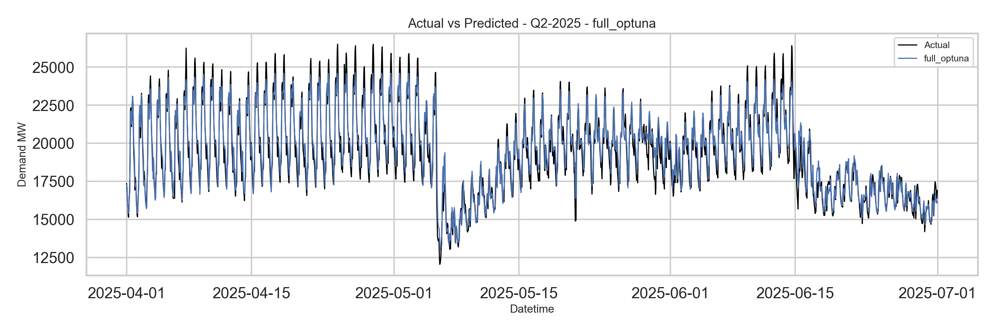
- 
- 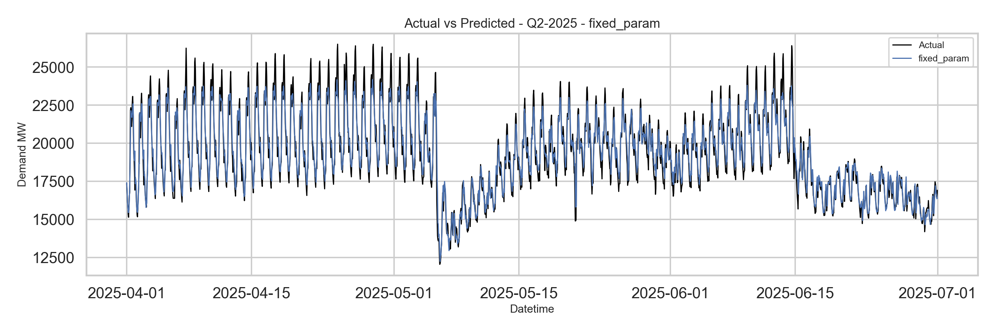
- 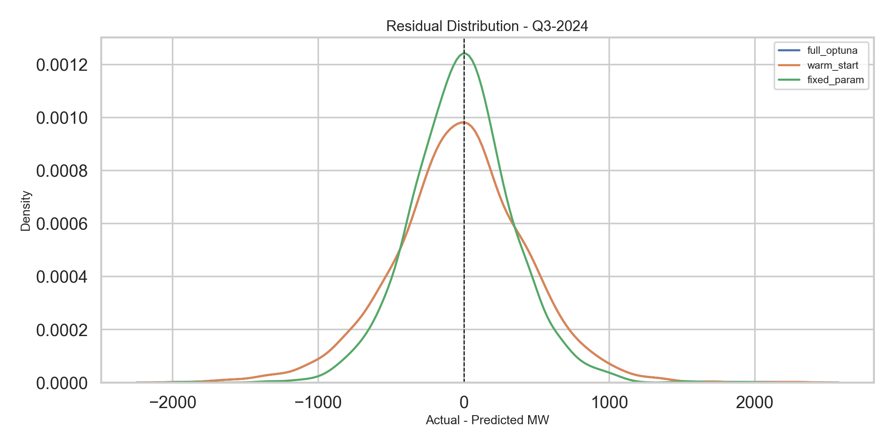
- 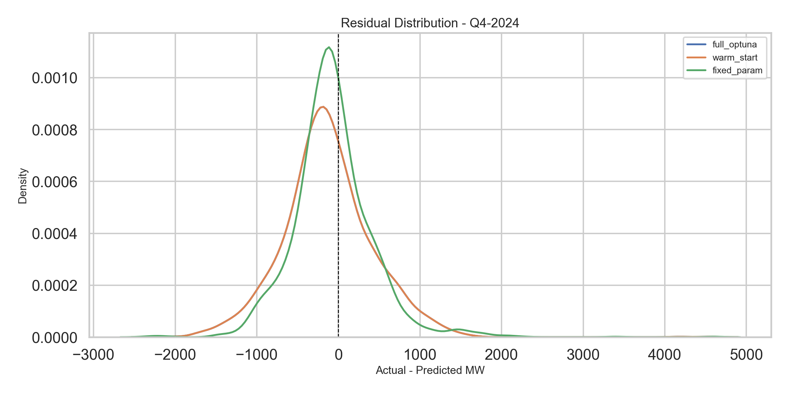
- 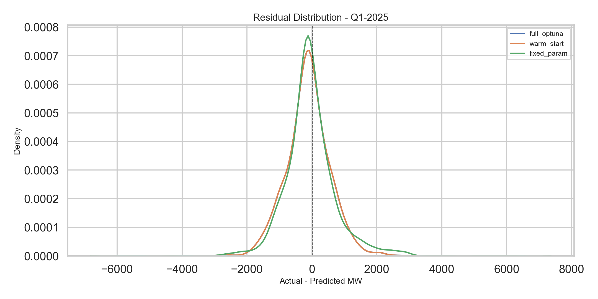
- 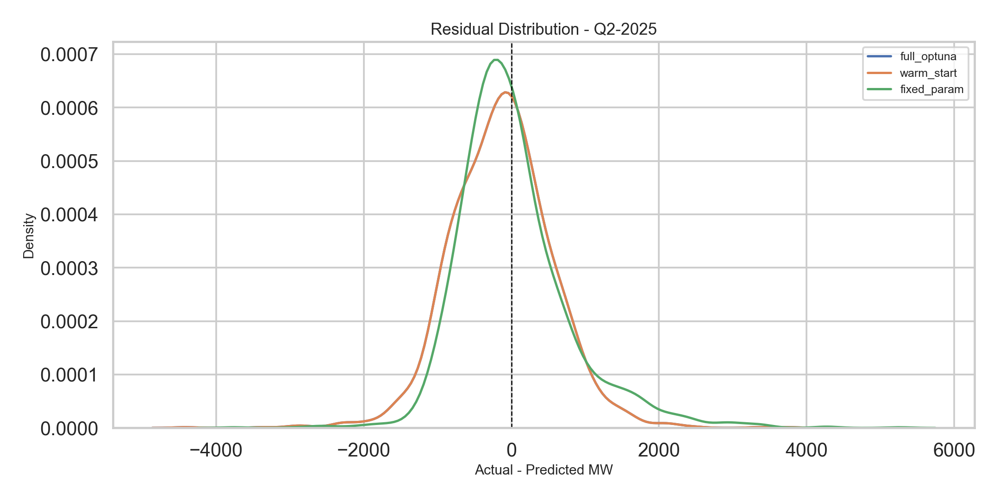

## 10. Winner Logic
Primary winner by average peak MAPE: **warm_start** with avg peak MAPE 2.6100% and avg runtime 0.01 minutes.

## 11. Notes
- Fixed-param evaluation uses the stored `xgboost_model.onnx` artifact from `/models`.
- The LSTM ONNX model is scored as a reference series for the same date range where alignment is possible.
- The walk-forward benchmark uses chronological expanding windows and never shuffles rows.